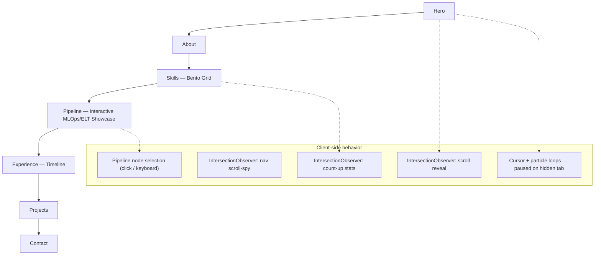
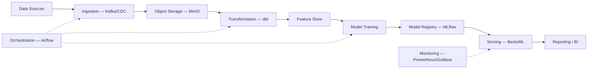

# Agus Mahari — Data Engineer Portfolio

<div align="center">


**A single-page, accessibility-first portfolio for a Data Engineer — including an interactive, keyboard-navigable showcase of an MLOps/ELT reference architecture.**

[🌐 Live Site](https://agusmahari.github.io) · [📧 Contact](#contact) · [🧭 Architecture Showcase](https://agusmahari.github.io/#pipeline)

</div>

---

## About This Repository

This repo holds the source for my personal portfolio: a single static HTML page documenting my background as a Data Engineer (cloud data warehousing, ELT pipelines, orchestration), plus an interactive section where I walk through a reference MLOps/ELT architecture I designed as a personal deep-dive.

**Important context for anyone reviewing the code:** this is a static front-end project. There is no backend in this repository — no Airflow, dbt, Docker, or MLflow actually running here. The Pipeline section you'll see on the live site is a hand-built, accessible UI component that documents and visualizes an architecture; it's a teaching/demonstration artifact, not deployed infrastructure. My production data-engineering work (Synapse/Fabric, Snowflake, CDC pipelines, etc.) is described in the Experience section of the site itself, tied to my actual employers.

Built with **HTML5**, **Tailwind CSS**, and **vanilla JavaScript** — no framework, no bundler, no `node_modules`.

---

## Features

- 📱 **Fully responsive** — tested down to 320px, with a dedicated mobile nav.
- 🌙 **Dark, terminal-inspired UI** with a custom color system (orange/red/magenta on near-black).
- 🧭 **Scroll-spy navigation** — the active nav link tracks scroll position via `IntersectionObserver`.
- 🧩 **Interactive architecture diagram** — an 11-node MLOps/ELT reference architecture, fully operable by mouse, keyboard (`Tab` + `Enter`/`Space`), or screen reader.
- 📊 **Animated, accessible stat counters** that respect `prefers-reduced-motion`.
- ♿ **Accessibility-minded throughout** — skip link, `aria-*` wiring on all interactive widgets, visible focus states, and a reduced-motion code path that disables decorative animation entirely.
- ⚡ **Performance-conscious** — the particle background and custom cursor pause automatically when the browser tab isn't visible; dense card grids use a hover-triggered blur instead of an always-on one.
- 🔍 **SEO-ready** — canonical URL, Open Graph + Twitter Card metadata, and `Person` JSON-LD structured data.
- 🚀 **Zero build process** — Tailwind via CDN, deployed directly to GitHub Pages.

---

## Site Architecture

The page is a single linear scroll, with each section as a self-contained `<section>`:



The Pipeline section's own internal flow — the thing it's *describing*, not running — looks like this:



> This second diagram documents the architecture I researched and designed for the portfolio's showcase — it is not deployed or running anywhere in this repository.

---

## Tech Stack

### What actually builds and runs this site

| Layer | Technology | Why |
| :--- | :--- | :--- |
| Markup | HTML5 (semantic) | `<main>`, `<nav>`, `<section>`, `<footer>` landmarks for accessibility and SEO, no framework overhead for a single page. |
| Styling | Tailwind CSS (CDN) | Fast iteration on a utility-first system without a build step, which matters for a project with no CI/CD pipeline. |
| Interactivity | Vanilla JavaScript | The page's logic (scroll-spy, reveal animations, the diagram's state) is simple enough that a framework would add weight without adding value. |
| Icons | Font Awesome | Wide icon coverage for skill badges and social links, loaded via CDN. |
| Fonts | Google Fonts (Syne, Space Mono) | Pairing a geometric display face with a monospace face to reinforce the "data/terminal" visual identity. |
| Hosting | GitHub Pages | Free, zero-config static hosting that matches a zero-build-step project. |
| SEO | JSON-LD, Open Graph, Twitter Card | Makes the page (and link previews of it) parseable by both search engines and recruiters' LinkedIn/X shares. |

### What's *shown*, not built (the Pipeline showcase content)

| Layer | Tools referenced in the diagram | Status |
| :--- | :--- | :--- |
| Ingestion / Streaming | Kafka, Debezium (CDC) | Conceptual — documented, not deployed |
| Storage | MinIO / object storage | Conceptual — documented, not deployed |
| Transformation | dbt | Conceptual — documented, not deployed |
| Orchestration | Airflow | Conceptual — documented, not deployed |
| ML Training / Serving | scikit-learn, XGBoost, MLflow, BentoML | Conceptual — documented, not deployed |
| Monitoring | Prometheus, Grafana | Conceptual — documented, not deployed |

---

## Engineering Highlights

These are claims about the front-end code in *this* repository, all verifiable by reading the source:

- **Rebuilt the architecture diagram for full accessibility.** The interactive Pipeline section was originally hover-only — unusable by keyboard or touch, and it auto-scrolled the page on every mouse pass. It now uses `role="button"` + `tabindex` + `aria-expanded`/`aria-controls` on each node, responds to `click` and `Enter`/`Space`, and only scrolls on a deliberate selection.
- **Eliminated duplicate logic and dead code** left over from earlier UI iterations — merged two copy-pasted event handlers into a single function, and removed orphaned CSS/JS from a UI pattern that was no longer used in the markup.
- **Cut unnecessary GPU work** by replacing an always-on `backdrop-filter: blur()` with a hover/focus-triggered variant (`.light-card`) across the **19 cards** in the Skills and Pipeline grids, where the constant blur cost was most concentrated.
- **Made decorative animation respect user preference.** Every animation loop — scroll reveal, the particle canvas, the custom cursor — checks `prefers-reduced-motion` and degrades gracefully (the cursor loop and particle canvas are skipped entirely; CSS transitions collapse to near-zero duration).
- **Stopped burning CPU/GPU in background tabs.** The cursor and particle `requestAnimationFrame` loops now pause on `visibilitychange` and resume automatically when the tab regains focus.
- **Built a fully accessible mobile menu** — `aria-expanded` sync, closes on outside click, closes on `Escape`, and traps no focus incorrectly.
- **Added scroll-spy navigation and animated counters**, both driven by `IntersectionObserver` rather than scroll-event polling, to avoid layout thrashing.

---

## Project Structure

```
agusmahari.github.io/
├── index.html                  # Entire site: markup, Tailwind config, CSS, and JS
├── assets/
│   ├── img/
│   │   ├── profile.jpg
│   │   └── og-image.png        # TODO: add (1200×630) for LinkedIn/X link previews
│   └── cv-agus-mahari.pdf      # TODO: add — the hero "Download CV" button links here
└── README.md
```

---

## Getting Started

No Node.js, no Python, no package manager required.

```bash
# 1. Clone the repository
git clone https://github.com/agusmahari/agusmahari.github.io.git
cd agusmahari.github.io

# 2. Open it
open index.html        # macOS
# or just double-click index.html in your file explorer
```

That works as-is, since every dependency (Tailwind, Font Awesome, Google Fonts) loads from a CDN and nothing fetches local files. For the smoothest editing experience (auto-reload on save), use a local server instead:

```bash
# Option A — VS Code Live Server
code .
# Right-click index.html → "Open with Live Server"

# Option B — Python's built-in server
python3 -m http.server 8000
# then open http://localhost:8000
```

---

## Customizing the Content

Everything lives in `index.html`; there's no templating layer to learn.

- **Text content** (About, Experience, Projects, Contact): edit directly in the corresponding `<section>` — content and markup are colocated.
- **Color palette**: defined once in the `tailwind.config` script in `<head>` (`primary`, `secondary`, `accent`, `bg`, `bg2`, `muted`).
- **Pipeline showcase nodes**: each node's title, description, and use cases live in the `mlopsData` JavaScript object inside the Pipeline section's `<script>` block — add a node there and a matching `data-node="..."` card in the HTML to extend the diagram.
- **Nav sections**: add an `id` to a new `<section>`, then a matching `<a href="#id" data-nav-link>` in both the desktop and mobile nav for scroll-spy to pick it up automatically.

---

## Accessibility & Performance Notes

- Skip-to-content link, semantic landmarks (`<main>`, `<nav>`, `<footer>`), and visible `:focus-visible` outlines throughout.
- The custom cursor only activates on devices reporting `(hover: hover) and (pointer: fine)` — touch users always keep their native cursor/tap behavior.
- All animation respects `prefers-reduced-motion: reduce`.
- Images use `loading="lazy"` and `decoding="async"`.
- External links carry `rel="noopener noreferrer"`.

---

## Roadmap

- [ ] Add `assets/cv-agus-mahari.pdf` (Download CV button currently points to a file that doesn't exist yet)
- [ ] Add `assets/img/og-image.png` (1200×630) for social link previews
- [ ] Replace the placeholder project links with real repository URLs once those projects are public
- [ ] Consider a compiled/purged Tailwind stylesheet instead of the CDN build for production performance

---

## Contact

<div align="center">

[](https://linkedin.com/in/agus-mahari/)
[](mailto:agusmahari@gmail.com)
[](https://wa.me/6285900243566)

</div>

<p align="center">
  Made by <strong>Agus Mahari</strong>
</p>
